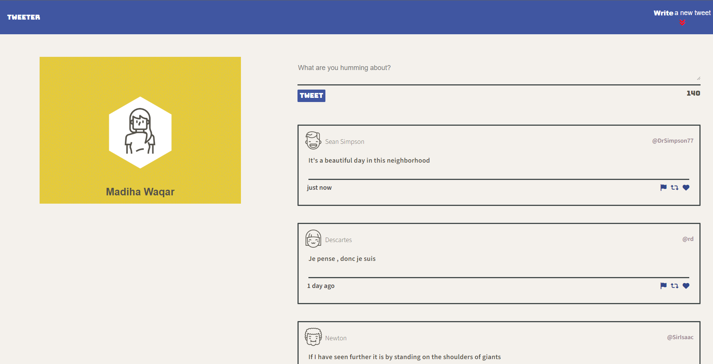
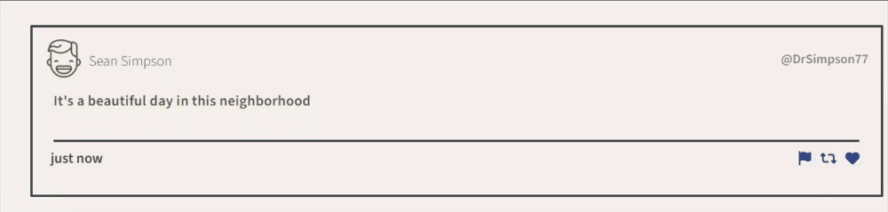
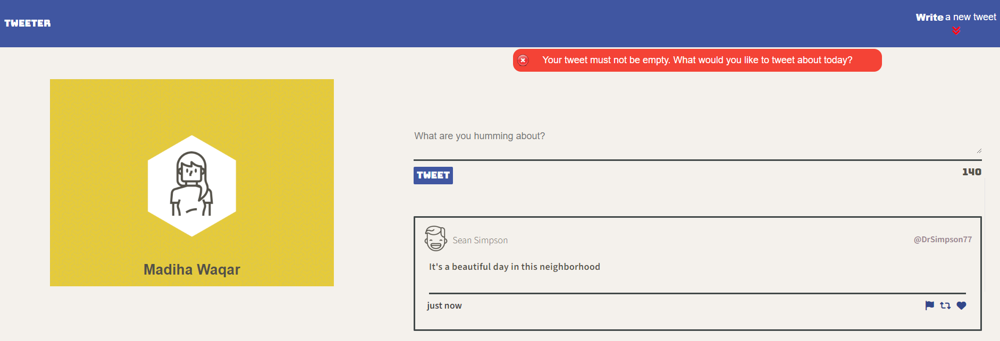
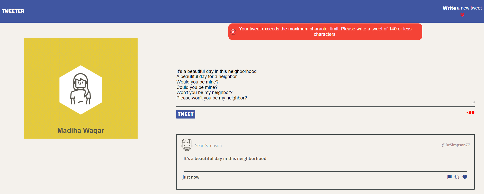
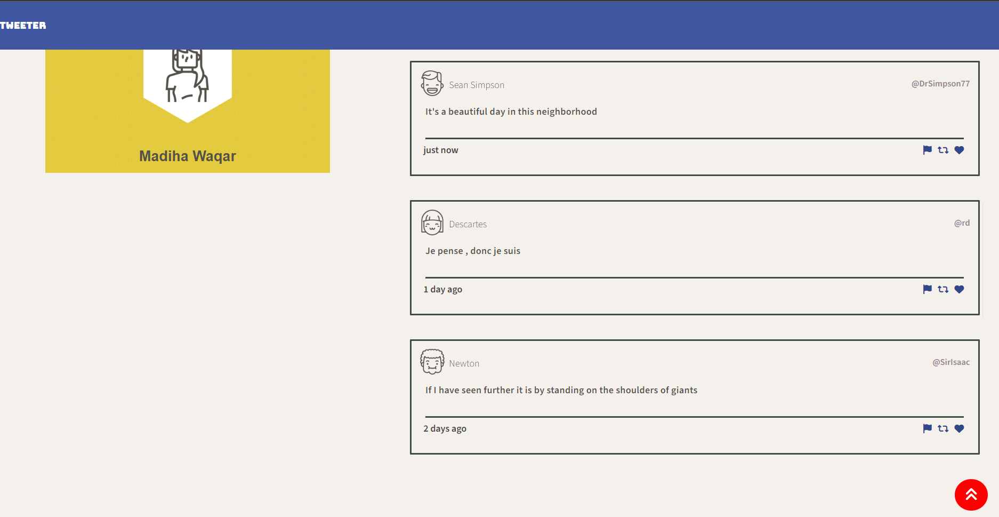
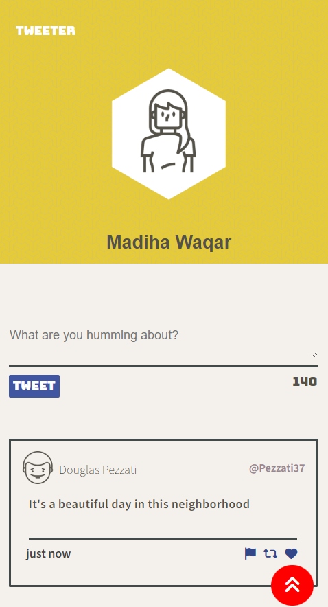

# :speech_balloon: Welcome to Tweeter
# Spread your thoughts ~ One tweet at a time! :loudspeaker:

Tweeter - Twitter clone is a simple, single-page web application that's user-friendly, visually dynamic, and responsive!

## Project Definition
Users can create short posts of up to 140 characters and have them append to the main page. Posts are sequential, with the most recent posts appearing at the top of the page. To do so, Tweeter fetches a list of posts from a simplified 'server' and allows users to add posts to this list dynamically. All the requests are asynchronous.

## Tweeter Project
This project is made by :raising_hand_woman: [Madiha Waqar](https://www.linkedin.com/in/madiha-waqar-a8253827) as part of Lighthouse Labs Web Development Flex Program curriculum. Tweeter is built using `HTML, CSS, JavaScript, jQuery and AJAX` for front-end, and `Node and Express`, for the back-end.

## :traffic_light: Dependencies
- Node
- Express
- body-parser
- chance
- md5

### :electric_plug: jQuery Plugin
- Timeago : It is a jQuery plugin that makes it easy to support automatically updating fuzzy timestamps

## :triangular_flag_on_post: Getting Started

1. [Create](https://docs.github.com/en/repositories/creating-and-managing-repositories/creating-a-repository-from-a-template) a new repository using this repository as a template.
2. Clone your repository onto your local device.
3. Install dependencies using the `npm install` command.
3. Start the web server using the `npm run local` command. The app will be served at <http://localhost:8080/>.
4. Go to <http://localhost:8080/> in your browser and tweet away! :hatching_chick:

## :sparkles: Final Product
 - Responsive design for screens 1024px and larger

 - Compose tweet form toggles up or down when arrow icon is pressed

 - On hover the tweet displays shadow and the social icons change color

 - Error is displayed on submitting empty tweet or tweet with white trailing spaces

 - Error is displayed when tweet text crosses character limit of 140

 - Scroll to top button which activates on page scroll

 - Responsive design for smaller screens   

## :dart: Features
- **Complete form design and implementation to compose tweets with retweet, like and share icons**
- **Tweets are rendered in real time and displays timeline of tweet posted by using timeago library**
- **Form submission using jQuery without causing the page to refresh**
- **Fetching tweets with AJAX**
- **Preventing XSS with Escaping**
- **Dynamic Form validation with jQuery**
   - Error displayed on submitting empty tweets
   - Error displayed when tweet cross character limits of 140
   - Form won't submit if user enters white spaces
- **Stretch Feature: Form Toggle**
  - Animation of new tweet arrow button
  - Toggling of new tweet form when arrow button is pressed
- **Stretch Feature: Slide to Top button**
  - Button appears when users scrolls the page
  - On scrolling down, scroll to top button appears and the nav button for new tweet disappears
  - On scrolling to top, nav button for new tweet should reappear and scroll to top button disappears
  - When scroll to top button is clicked the page scrolls to the top and the form slides down with textarea enabled
 - **Character counter**
   - Character counter starts at 140 and is decremented dynamically
as the user types in the textarea
   - Counter turns red when more than 140 characters have been
typed into the textarea

## :computer: Responsive Design :iphone:
- On larger screens such as desktops and laptops with a width over 1024 pixels, your profile will be positioned on the left side while tweets will be displayed on the right side.
- On smaller devices like mobile and tablets, the sections will be rearranged to stack on top of each other. In this layout, the profile section will appear on top, followed by the tweets section at the bottom in single line column.

## :fire: Enjoy
Thank you for taking the time to explore `Tweeter`! I hope that you enjoyed my take on Twitter. Feel free to dive in and check all implemented features!